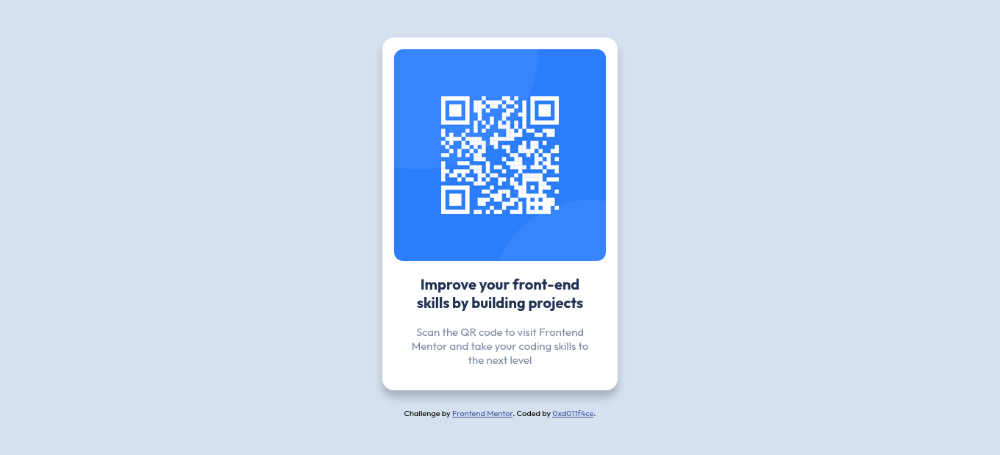

# Frontend Mentor - QR code component solution

This is a solution to the [QR code component challenge on Frontend Mentor](https://www.frontendmentor.io/challenges/qr-code-component-iux_sIO_H). Frontend Mentor challenges help you improve your coding skills by building realistic projects.

## Table of contents

- [Overview](#overview)
	- [Screenshot](#screenshot)
	- [Links](#links)
- [My process](#my-process)
	- [Built with](#built-with)
	- [What I learned](#what-i-learned)

## Overview

### Screenshot

### Links

- Solution URL: [https://github.com/0xd011f4ce/FrontendMentor/tree/main/1.%20QR%20Code](Here)
- Live Site URL: [https://0xd011f4ce.github.io/FrontendMentor/1.%20QR%20Code/](Here)

## My process

### Built with

- HTML5
- CSS
- Flexbox

### What I learned

At first, I centered all the elements in the website using flexbox and setting
the flexbox container to the **body** element, but I felt it wasn't the best way
of doing so, so I changed it to use absolute positioning in the qr container and
setting its top and left values to 50% and translating it to -50% in both top
and bottom as transform works with the element's sizes.

It took me a little thinking to remember this "_trick_" with the absolute
positioning, so I am putting it here, just in case I ever need to come back to
my notes for future reference.
